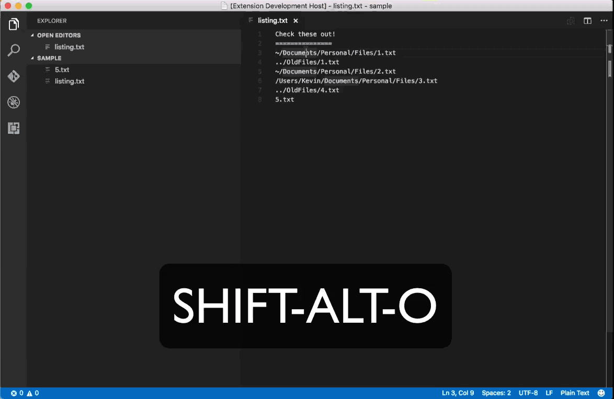
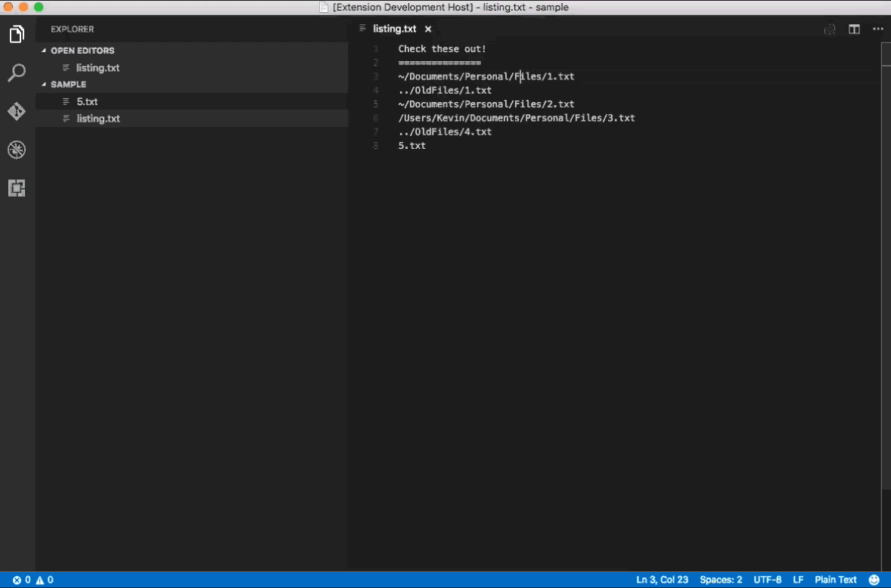
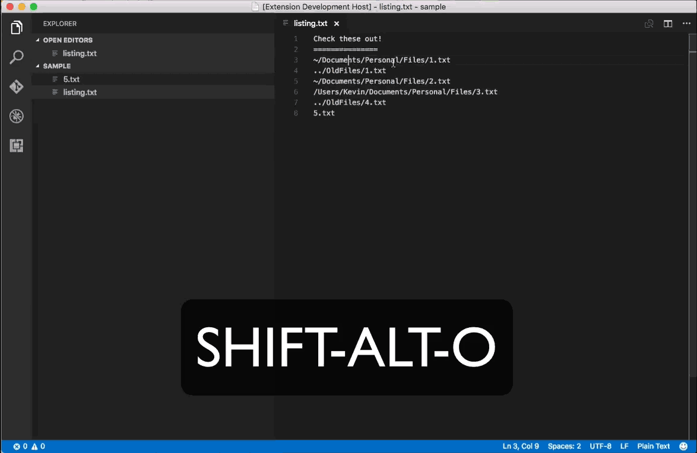
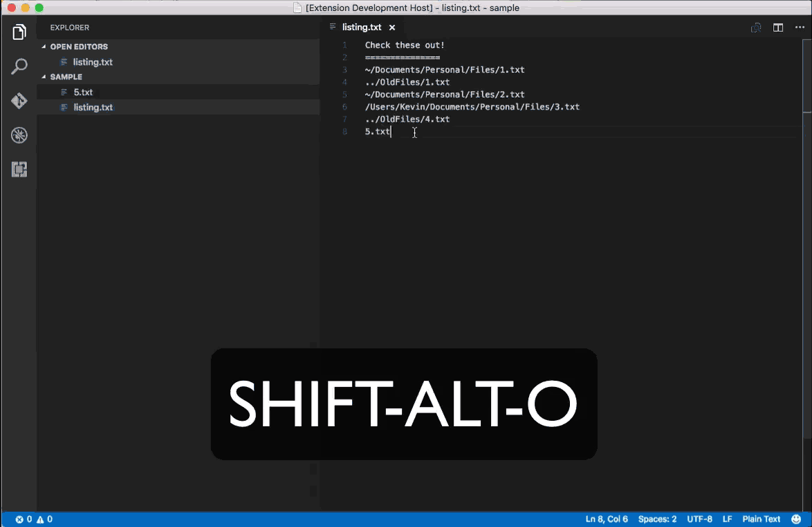

# open-under

*open-under* was built out of the need to quickly open a set of files from a collection of file paths in the vscode editor.  Paths can be absolute, relative to the HOME folder, or relative to the workspace folder.  	

####Open a single file w/ Shift-Alt-O keystroke  

####Open a single file w/ Command Palette  

####Open a single file w/ Selection & Keystroke

####Open multiple files w/ Selection & Keystroke

Use at your own risk.  This was a quick project to solve a recurring issue.  Feel free to modify as you wish.  I only intended to get it started.

**Enjoy!**
